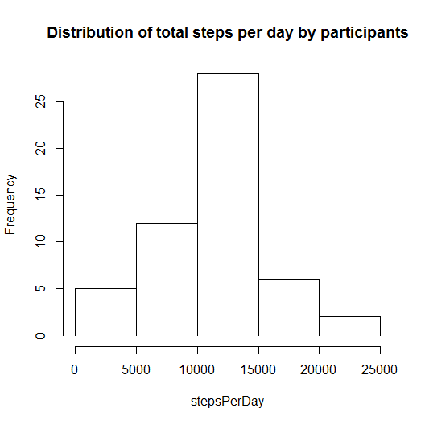
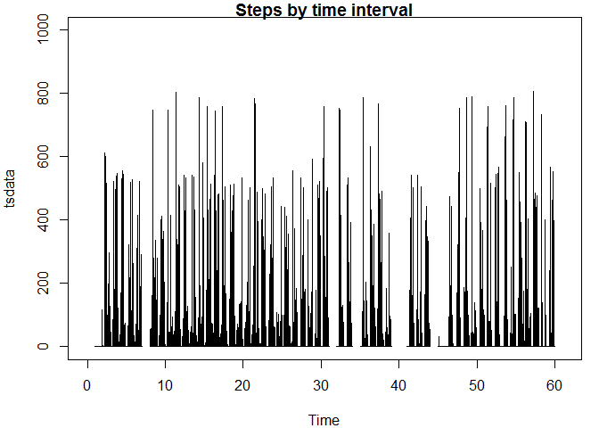
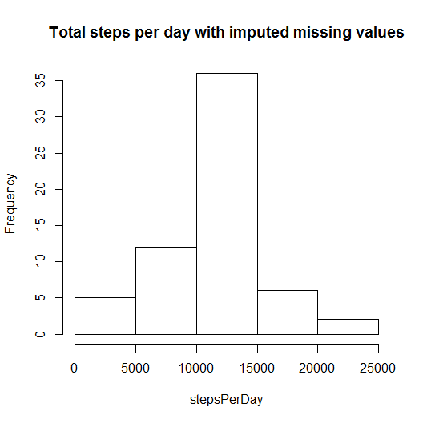
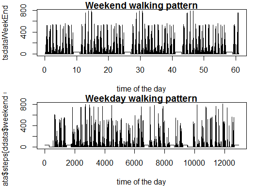

Reproducible Research Project One
=================================

## Executive Summary

This document is prepared in response to a home work assignment in the *Coursera* course entitled *Reproduciable Research*.  The following R code and output are as requested in the home work assignment.

## Working Directory and library packages 

We first set our working directory, libraries and download the provided data sets as follows:

```r
setwd("C:/Users/Robert/Coursera/ReproducibleResearch/PeerAssignment1")
library(lattice); library(ggplot2); library(plyr); library(Hmisc); library(zoo); library(nutshell)
```

```
## Loading required package: grid
## Loading required package: survival
## Loading required package: splines
## Loading required package: Formula
## 
## Attaching package: 'Hmisc'
## 
## The following objects are masked from 'package:plyr':
## 
##     is.discrete, summarize
## 
## The following objects are masked from 'package:base':
## 
##     format.pval, round.POSIXt, trunc.POSIXt, units
## 
## 
## Attaching package: 'zoo'
## 
## The following objects are masked from 'package:base':
## 
##     as.Date, as.Date.numeric
## 
## Loading required package: nutshell.bbdb
## Loading required package: nutshell.audioscrobbler
```
The provided data set has been previously saved in the above directory and will be downloaded as below.  The provided *date* variable is converted to the standard format for time/date values and a sequence data is created.

```r
ddata <-read.csv("activity.csv")
ddata$yxdate <- as.Date(ddata$date)
ddata$numdate <- as.numeric(ddata$yxdate)
```
## Mean Steps Per Day

1. Histogram of total number of steps taken each day

The aggergate or *by* function is used below to sum the number of step per day


```r
     stepsPerDay <-by(ddata$steps, ddata$numdate, sum)
     stepsPerDay2 <- rowsum(ddata$steps, group = ddata$date)
```

The following plot presents a hitogram of the distribution of daily steps.


```r
hist(stepsPerDay, main = "Distribution of total steps per day by participants") 
```

 

2.  The Mean and Median total number of steps taken per day

We present the calculation of mean steps per day computes using the *by* and *rowsum* built in functions.


```r
meanStepsPerDay <- mean(stepsPerDay, na.rm = TRUE)
meanStepsPerDay
```

```
## [1] 10766
```

```r
meanStepsPerDay2 <- mean(stepsPerDay2, na.rm = TRUE)
meanStepsPerDay2         
```

```
## [1] 10766
```

```r
#  And the median steps per day:
medianStepsPerDay <- median(stepsPerDay, na.rm = TRUE)
medianStepsPerDay
```

```
## [1] 10765
```

## Steps by time intervals (Average Daily Activity Pattern)

1.  Time series line plot of time interfals (x-asis) and average steps
 
We subtract the numerial value of the first day (15614) to obtain a series starting at zero time.
Second, it is wise to create a time series data object which may facilitate this analysis.


```r
tsdata <- ts(data = ddata$steps, start = 0, end = 61, frequency = 288)
```

A plot of steps per day for the provided data appears below;


```r
par(mar = c(4,4,1,1))
plot(tsdata, ylim = c(0, 1000), main = "Steps by time interval", type = "l")  
```

 
    
2. Time of the day with the most steps taken 

The following code calcuates the mean number of steps for each of the provided 5 minute time intervals and then identifices the time with the highest mean valuse of steps taken.


```r
mean_AggByInterval <- aggregate(ddata$steps,
    by = list(ddata$interval), mean, na.rm = TRUE)
head(mean_AggByInterval$x)
```

```
## [1] 1.71698 0.33962 0.13208 0.15094 0.07547 2.09434
```

```r
rowsum_ByInterval <- rowsum(ddata$steps, group = ddata$interval, na.rm = TRUE)
maximumStepsInAnInterval <- max(mean_AggByInterval$x)
maximumStepsInAnInterval
```

```
## [1] 206.2
```

```r
timeOfGreatestSteps <-mean_AggByInterval$Group.1[maximumStepsInAnInterval]
# The time of the day with the highest mean number of steps recorded is:
timeOfGreatestSteps
```

```
## [1] 1705
```

The above reports that the five minute time slot with the *highest average steps per five minute interval starts at 1705*.  The highest average is captured by IntervalWithMaxAvgSteps or 206.1698
 
## Imputing Missing Values

We take the most direct approach and simply use the avarage for all time intervals across all days and assign it to each value missing.


```r
timeIntervalsMissingSteps <- sum(is.na(ddata$steps))
indexOfMissing <- is.na(ddata$steps)
ddata[indexOfMissing, 1]  <- mean(ddata[!indexOfMissing, 1])
```

Some 2304 time slots have a NA code for the number of steps taken.  A such NA codes have been replaced with the mean of the data set.

The following code re-computes the total steps per day with the above imputed value for missing values.  The histogram includes imputed values for values that are missing:

```r
     stepsPerDay <-by(ddata$steps, ddata$numdate, sum)
     stepsPerDay2 <- rowsum(ddata$steps, group = ddata$date)
hist(stepsPerDay, main = "Total steps per day with imputed missing values")
```

 

## Comparison of steps or activity on weekdays versus weekends

The R function #weekdays* is used below to seperate the data set into weekdays and weekends.
The distribution of time intervals by days of the week is:


```r
table(weekdays(ddata$yxdate))
```

```
## 
##    Friday    Monday  Saturday    Sunday  Thursday   Tuesday Wednesday 
##      2592      2592      2304      2304      2592      2592      2592
```

Two seperate groups are created as below:


```r
ddata$weekend <- (ifelse(weekdays(ddata$yxdate) == "Sunday" |
weekdays(ddata$yxdate) == "Saturday", TRUE, FALSE))
table(ddata$weekend)  # Weekend is TRUE
```

```
## 
## FALSE  TRUE 
## 12960  4608
```

```r
# Seperate weekday and weekend data sets are created:
tsdataWeekEnd <- ts(data = ddata$steps[ddata$weekend[TRUE]], start = 0, end = 61, frequency = 288)
#, start = 0, end = 61, frequency = 288)
```

A plot of weekend steps and weekday steps is given below:

 
 ```r
 par(mar = c(4,4,1,1))
 par(mfrow=c(2,1))
 plot(tsdataWeekEnd, main = "Weekend walking pattern", xlab = "time of the day")  # for wekend steps
 plot(ddata$steps[ddata$weekend==FALSE], type = "l", main = "Weekday walking pattern",
 xlab = "time of the day")
 ```
 
  

The plots for steps during weekends and during weekdays present evidence that of more consistant walking patterns during the weekend and evidence of a more random like behaviour durig the non-weekend days of the week.

